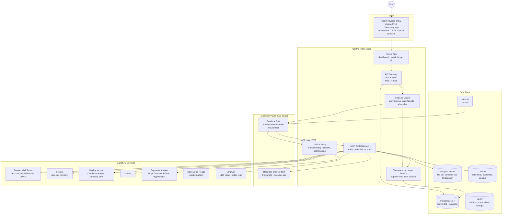

# OPENCORP — Autonomous Company Platform
## Agent Instruction File & Full Technical Specification

> **Audience:** This document is written as an instruction file for an implementing agent (e.g., Claude Code) and for human engineers. Every section contains concrete, opinionated technical decisions. When a choice is made, build that choice; alternatives are listed only as fallbacks.
>
> **Mission:** Reproduce the core idea behind NanoCorp (nanocorp.so) — *"autonomous companies run by AI"* — with **radical transparency**: every agent decision, tool call, token spent, and cent earned is auditable on a hash-chained ledger.

---

## 0. Current priority — local MVP (read this first)

The **immediate goal is an MVP that runs on a single laptop with minimal external dependencies**, not a multi-tenant, internet-facing, self-hostable-by-others platform. Open-source distribution and full self-hosting (Helm, public domains, deliverability) are explicitly **deferred to a later phase**. Where this section conflicts with the rest of the spec, this section wins for now.

**The MVP stack is three things:**
1. **PostgreSQL** — control DB + ledger + per-company DBs (one container).
2. **Temporal** — the durable workflow engine (one container).
3. **One LLM** — a single API key (e.g. Anthropic Haiku) via LiteLLM, *or* a local model. This is the only irreducible external dependency; with no key the worker falls back to a deterministic offline policy and the platform still runs end-to-end.

**Everything else is OFF by default and the app degrades to a local/offline mode** (already implemented as provider seams): E2B → `subprocess`/`local` pool (no cloud, no public URLs); Stripe → local checkout / `payments=none`; Infisical → env-var secrets; Stalwart → DB-mirror-only email; Forgejo, Umami, Langfuse, Lago, OpenMeter, MinIO, Valkey → unused. Turn any of them on later by setting its env vars.

**Run it:** `cp .env.example .env` (optionally add one LLM key) → `bun run dev` (brings up infra, migrates, launches api + gateway + worker + deployd + web) → create a company from one prompt. Auth is disabled locally (single dev owner); never expose that build publicly.

**MVP Definition of Done:** on one machine, `bun run dev` + one LLM key lets you type a prompt and get a company with a mission, a CEO that plans, autonomous worker tasks that write code / query the per-company DB / deploy a local site, and every action on a verifiable hash-chained ledger — with zero external accounts beyond the LLM.

The sections below describe the **full production vision** (E2B, Stalwart, Stripe, Helm, etc.); treat them as the roadmap *after* the MVP, and read every "binding" external service as "optional, off in the MVP."

---

## 1. Reverse-Engineered Feature Analysis (what we are reproducing)

Derived from NanoCorp's public site, documentation, FAQ, rate-limit docs and API surface:

| # | NanoCorp feature | Observed behavior | OpenCorp equivalent |
|---|---|---|---|
| 1 | **One-prompt company creation** | User writes a prompt → platform spins up a company with a mission, a CEO agent, a website, an email address, a DB, a repo, a payment link — in under ~2 min | `POST /companies` orchestration workflow (Temporal) provisioning all resources |
| 2 | **CEO agent** | Persistent chat agent per company; free to talk to; plans, creates tasks, updates mission; cannot pause the company itself | Long-lived "Executive" agent with planning loop + task creation tools |
| 3 | **Worker agents** | CEO delegates tasks to specialized workers executing in isolated sandboxes; one task per company at a time | Ephemeral worker agents in E2B-hosted microVM sandboxes, serialized per company via workflow mutex |
| 4 | **Task system** | Tasks have states (pending/to-do/running/failed/done), daily caps ("Task Throttle"), conglomerate-wide credit caps, manual Run overrides caps, failed tasks auto-refund | Durable Temporal workflows + Postgres task table + credit ledger with compensating refund transactions |
| 5 | **Scheduling** | Agents "run on schedules, complete tasks, report back"; one autonomous dispatch cycle per day per company | Temporal Schedules (cron) per company → dispatch workflow |
| 6 | **Tool belt** | Payments (products, payment links, revenue), website deploy (subdomain + custom domain), real send/receive email, browser automation, documents/KB, prospect search, analytics, dedicated Postgres per company, full Linux code sandbox, GitHub repo | MCP tool servers (§7), one server per capability domain |
| 7 | **Rate limits** | Per-company hourly/daily caps on write tools; structured JSON errors with `retry_after_s`, `should_wait`; failing calls still count | Redis sliding-window limiter in the MCP gateway, identical error contract |
| 8 | **Credits & billing** | Credits per task (~1 avg, complexity-based), monthly grants, Stripe subscriptions, referral credits | OpenMeter (usage) + Lago (plans); credits = internal double-entry ledger |
| 9 | **Revenue & withdrawals** | Platform-proxied Stripe; real balance per company; Stripe Connect Express payouts | Same pattern via Stripe Connect; abstracted behind a `PaymentsProvider` interface (Hyperswitch as OSS alternative) |
| 10 | **Conglomerate dashboard** | Multi-company overview, real-time activity, credits panel | Next.js dashboard + SSE event stream |
| 11 | **Public live feed** | "Watch companies working autonomously live" | First-class: public, append-only, hash-chained event ledger + trace explorer (our differentiator) |
| 12 | **Secrets** | Users share API keys/config with agents safely | Infisical (OSS) per-company projects, injected into sandboxes at runtime |
| 13 | **Code access** | Per-company GitHub repo, collaborator invites on $120+/mo tiers | Forgejo (self-hosted) repo per company; always accessible — no paywall on your own code |
| 14 | **Ads (coming soon)** | Autonomous Google/Meta ads with budget | Phase 5; adapter pattern over ad platform APIs |

**Deliberate divergences (our advantages):**
- **Transparency by default**: raw public ledger of every LLM call, tool call, and financial movement (NanoCorp shows a curated live feed; we publish the chain).
- **Bring-your-own-model & self-hosting**: explicitly supported (NanoCorp FAQ says no to both).
- **Exportability**: code, DB, and full event history exportable at any time.

---

## 2. High-Level Architecture



**Three planes, strictly separated:**
1. **Control plane** — stateless services on k3s. Never executes agent code.
2. **Execution plane** — E2B-hosted microVMs (one per task). Agents only run here; because it lives in E2B's cloud, the MCP gateway and LLM proxy must be publicly reachable.
3. **Capability services** — everything a company "can do" is reachable from sandboxes *only through the MCP gateway* (single choke point → uniform auth, rate limits, audit).

---

## 3. Technology Decisions (binding)

| Concern | Decision | Rationale | Fallback |
|---|---|---|---|
| Backend languages | **TypeScript (Bun) throughout, including the sandbox pool** | TS shares types with frontend & MCP SDK; the E2B SDK is TS-native | Python/FastAPI |
| Frontend | **Next.js 15 (App Router) + Tailwind + shadcn/ui** | SSR for public ledger pages (SEO), streaming UI | SvelteKit |
| Workflow engine | **Temporal (self-hosted)** | Durable execution is the heart of "autonomous": retries, cron schedules, signals (pause/run-now), per-company serialization via workflow ID `company:{id}`, step-level visibility | Hatchet (Postgres-only, lighter) |
| LLM gateway | **LiteLLM proxy** | One OpenAI-compatible endpoint; routes to self-hosted vLLM and/or commercial APIs; per-company virtual keys, budgets, fallbacks, cost logs | OpenRouter (not self-hosted) |
| Default model routing | **Planner/CEO:** DeepSeek-V3.x or Qwen3-235B (API or self-hosted) · **Workers:** Qwen3-Coder-32B / Qwen3-32B · **Classification/summaries:** Qwen3-4B | Open weights, strong tool use; tiered routing is the #1 cost lever | Any OpenAI-compatible model |
| Inference serving | **vLLM**, prefix caching ON | Best OSS throughput; system prompts repeat per company → big cache hits | SGLang |
| Tool protocol | **MCP** — every capability is an MCP server | Open standard; clean authz seam; reusable by any MCP client | Plain OpenAPI tools |
| Primary DB | **PostgreSQL 17 + pgvector** | Source of truth; LISTEN/NOTIFY feeds SSE; pgvector for agent memory | — |
| Per-company DB | **Dedicated database per company on shared PG cluster** via **PgBouncer**, provisioned by a Temporal activity | Matches "dedicated Postgres with full SQL access"; cheap isolation; quotas enforced | Neon self-host (heavy) |
| Cache/limits/pubsub | **Valkey** | Sliding-window limits, sandbox pool bookkeeping | Redis |
| Object storage | **MinIO** | Screenshots, artifacts, attachments, ledger checkpoints | Garage |
| Sandboxes | **E2B hosted microVMs** (e2b.dev) behind the TS `sandboxd` pool abstraction: one sandbox per task, ~150–400 ms create, custom template = Debian + Bun; agentd bundle uploaded at claim | True Firecracker VM isolation without operating the fleet ourselves (boot, snapshots, networking, GC are E2B's problem); pay-per-second | `subprocess` pool (OS-process isolation) for local/dev |
| Browser automation | **Playwright + browser-use** in-sandbox; shared headless fleet for heavy sessions | OSS, robust extract/screenshot primitives | Chromedp |
| Email | **Stalwart Mail Server** (Rust; SMTP/IMAP/JMAP; DKIM/SPF/DMARC/ARC built-in). One domain, address per company `{slug}@opencorp.app` | Modern single binary; JMAP is ideal for programmatic send/receive | Postal; SES relay for deliverability |
| Website hosting | **Caddy** wildcard `*.opencorp.app` + **on-demand TLS** for custom domains; deploy service publishes static/SSR builds; SSR apps as per-company containers | Replaces Vercel; custom domain = one CNAME | Coolify (full PaaS, heavier) |
| Git hosting | **Forgejo** | OSS Gitea fork; org per conglomerate, repo per company; API for invites | Gitea |
| Analytics | **Umami** | Lightweight, OSS, API for `get_analytics` | Plausible CE |
| Auth | **Better Auth** (orgs = conglomerates) | OSS, embeds in Next.js | Zitadel |
| Secrets | **Infisical (self-hosted)** | Per-company projects, machine identities for sandboxes | OpenBao |
| Metering/billing | **OpenMeter** (events) + **Lago** (plans/invoices) + internal **credit ledger** in PG | Credits ledger is source of truth; Lago handles tiers | Kill Bill |
| Payments (company money) | **Stripe + Connect Express** behind `PaymentsProvider` interface | No production-grade OSS card acquiring exists; Stripe is pragmatic. **Hyperswitch** (OSS orchestrator) as alternative implementation | `payments=none` mode |
| Prospecting | **No OSS Apollo exists.** `prospect-mcp` = Playwright public-web search + open datasets + pluggable BYO-key enrichment drivers (Apollo/Hunter keys via Infisical) | Honest about the gap; pluggable | — |
| LLM observability | **Langfuse (self-hosted)**, public read-only project per company | Traces every generation; public trace URLs power transparency | Phoenix |
| Metrics/logs | **Prometheus + Grafana + Loki + OpenTelemetry** | Standard | — |
| Infra | **k3s** on Hetzner for the control plane; sandboxes are E2B-hosted (no KVM/bare metal needed); optional GPU node for vLLM | Best perf/€; execution plane is pay-per-use | Any K8s |

---

## 4. Domain Model (control DB, Postgres)

```sql
-- Tenancy
conglomerates(id, owner_user_id, name, daily_credit_cap, created_at)
users(...)                                  -- Better Auth tables
memberships(user_id, conglomerate_id, role)

-- Companies
companies(
  id, conglomerate_id, slug UNIQUE, name, mission TEXT,
  status ENUM('active','paused'),           -- Task Throttle PAUSED
  daily_task_cap INT DEFAULT 3,             -- Task Throttle slider
  subdomain, custom_domain, email_address,
  db_name, forgejo_repo, umami_site_id,
  real_balance_cents BIGINT DEFAULT 0,
  autonomy_level ENUM('supervised','bounded','full') DEFAULT 'supervised',
  is_public BOOLEAN DEFAULT true,           -- transparency opt-out
  created_at
)

-- Agents
agents(id, company_id, kind ENUM('ceo','worker'), name, role_prompt TEXT,
       model_tier ENUM('frontier','standard','mini'), created_at)

-- Tasks
tasks(
  id, company_id, created_by_agent_id, title, description,
  status ENUM('pending','queued','running','failed','done','deleted'),
  priority INT, scheduled_for TIMESTAMPTZ NULL,
  credits_estimated NUMERIC, credits_charged NUMERIC,
  temporal_workflow_id, result_summary TEXT, error TEXT,
  created_at, started_at, finished_at
)

-- Credits: double-entry, immutable
credit_entries(
  id BIGSERIAL, conglomerate_id, company_id NULL, task_id NULL,
  delta NUMERIC NOT NULL,                   -- +grant, -charge, +refund
  reason ENUM('grant','task_charge','task_refund','referral','adjustment'),
  meta JSONB, created_at
)
-- balance = SUM(delta); checked non-negative at dispatch

-- Transparency ledger: append-only hash chain (§9)
ledger_events(
  seq BIGSERIAL PRIMARY KEY,
  company_id, actor,                        -- 'ceo'|'worker:{task}'|'system'|'user'
  event_type,                               -- tool_call, tool_result, llm_call,
                                            -- task_state, credit_change, money_in,
                                            -- money_out, deploy, email_sent ...
  payload JSONB,                            -- redacted (§9.3)
  prev_hash BYTEA, hash BYTEA,              -- sha256(prev_hash||canonical(payload)||seq||ts)
  created_at
) PARTITION BY RANGE (created_at);

-- Knowledge base / agent memory
documents(id, company_id, title, content TEXT, embedding vector(1024),
          created_by, updated_at)

-- Email mirror (synced from Stalwart via JMAP)
emails(id, company_id, direction ENUM('in','out'), from_addr, to_addrs TEXT[],
       subject, body_text, body_html, jmap_id, read BOOLEAN, created_at)

-- Products & money
products(id, company_id, name, price_cents, currency, provider_ref)
payments(id, company_id, product_id, amount_cents, currency, provider_ref,
         fee_cents, net_cents, created_at)
withdrawals(id, conglomerate_id, amount_cents, provider_transfer_id, status, created_at)
```

---

## 5. Agent Architecture

### 5.1 Roles

```
User ──chat──▶ CEO Agent (persistent, per company)
                  │ plans, prioritizes, writes mission, creates/updates tasks,
                  │ reads reports, briefs the user. NEVER executes long work itself.
                  ▼
            Task Queue (Postgres + Temporal)
                  │ one task running per company at a time (workflow mutex)
                  ▼
              Worker Agent (ephemeral, per task)
                  │ fresh E2B sandbox containing:
                  │  - role prompt + task brief + RAG-retrieved KB docs
                  │  - MCP gateway token scoped to {company, task}
                  │  - company secrets injected via Infisical machine identity
                  ▼
              Report ──▶ KB doc + summary to CEO + ledger event
```

### 5.2 CEO loop — `CompanyHeartbeat` Temporal workflow (cron, default daily)

```
1. Gather context: mission, last N task reports, revenue delta,
   analytics delta, unread-inbox digest, credit balance, caps.
2. LLM call (frontier tier), guided JSON output:
   { keep_doing[], stop_doing[], new_tasks[], mission_patch?, user_brief }
3. Apply: create/update tasks; optionally patch mission (ledger event).
4. Dispatch loop:
   while daily_task_cap not reached
     AND conglomerate daily credit cap not reached
     AND company.status == 'active'
     AND no task currently running:
       pop highest-priority queued task → start TaskRun child workflow
5. Post "Daily brief" to the user (in-app + optional email).
```

**Cap semantics (NanoCorp-identical):** caps pause *autonomous* dispatch only. A manual **Run** in the dashboard sends a Temporal signal and executes immediately if credits exist. Pause is a dashboard action (signal) — never an LLM tool; the CEO cannot pause its own company.

### 5.3 Worker lifecycle — `TaskRun` workflow

```
acquire company mutex (Temporal workflow-id reuse policy)
→ charge estimated credits (ledger entry: task_charge)
→ create a fresh E2B sandbox (~150–400 ms, lifetime capped at wall clock + grace)
→ inject MCP token, Infisical identity, repo clone (Forgejo deploy key)
→ agent loop (ReAct: think → MCP tool → observe), hard budgets:
     30 min wall clock · 80 steps · 400k tokens
     2 vCPU / 4 GB RAM / 8 GB disk · 1 GB egress
     (enforced by Temporal timeouts + sandbox kill + E2B lifetime — never by prompt)
   every step streamed: SSE → dashboard, trace → Langfuse, event → ledger
→ success: write report doc, reconcile credits (charge actual, refund diff)
→ failure/timeout: FULL refund (task_refund), mark failed; CEO sees it next heartbeat
→ destroy sandbox (never reused across tasks)
```

### 5.4 Prompting & memory

- **Prompts are versioned files** (`/prompts/ceo.md`, `/prompts/worker_*.md`); the prompt hash is recorded in every ledger event → reproducibility.
- **Memory:** KB documents + pgvector embeddings (bge-m3 or Qwen3-embedding via TEI/vLLM). Worker context = task brief + top-k docs + mission. No hidden memory.
- **Structured outputs:** vLLM guided decoding (JSON schema) for planner outputs; schema-repair retry on violation.
- **Routing:** LiteLLM virtual key per company tags every call; fallback chain frontier → standard → mini with per-company daily token budget.

---

## 6. Company Provisioning — `CreateCompany(prompt)` (target P50 < 60 s)

1. **LLM (mini tier):** extract `{name, slug, mission, initial_tasks[3..5], landing_copy}` (guided JSON).
2. **Parallel Temporal activities:**
   - create Postgres DB `corp_{slug}` + role with quota
   - create Forgejo repo from template (Astro landing starter) + deploy key
   - create Stalwart mailbox `{slug}@opencorp.app` (JMAP admin API)
   - create Umami site
   - create Infisical project + machine identity
   - register subdomain route via Caddy admin API
3. **First deploy (fast path, no agent):** render landing template with `landing_copy`, push, build, publish to `{slug}.opencorp.app`.
4. **Seed tasks**, emit `company_created` ledger event, schedule first heartbeat.

All steps idempotent (Temporal retries handle partial failures).

---

## 7. Tool Layer — MCP Servers & Gateway

One **MCP gateway** (Bun) terminates every tool call from sandboxes: token scope check (company+task), Zod input validation, rate limits, audit → ledger, then routes to capability servers.

### 7.1 Tool inventory (NanoCorp parity + extras; write tools in **bold**)

| MCP server | Tools | Backed by |
|---|---|---|
| `payments-mcp` | **create_product**, **delete_product**, list_products, get_payment_link, get_revenue | Stripe Connect / Hyperswitch adapter |
| `web-mcp` | **deploy_site**, **set_env_vars**, list_env_vars, get_deploy_status, **set_custom_domain** | deployd + Caddy admin + Forgejo CI |
| `email-mcp` | **send_email**, **reply_email**, read_email, list_emails, mark_email_read, **verify_email** | Stalwart JMAP |
| `browser-mcp` | navigate, click, type, extract, screenshot, **submit_form** (gated) | Playwright fleet |
| `docs-mcp` | **create_document**, **update_document**, list_documents, read_document, search_documents | PG + pgvector |
| `prospect-mcp` | **search_prospects**, enrich_contact (pluggable driver) | Playwright/public data + BYO-key drivers |
| `analytics-mcp` | get_analytics | Umami API |
| `db-mcp` | run_sql (read), **execute_sql** (write), get_schema | per-company PG via PgBouncer |
| `code-mcp` | exec, read_file, write_file, **git_commit_push** | in-sandbox + Forgejo |
| `org-mcp` | get_company_info, read_mission, **update_mission**, create_task, update_task, delete_task, list_tasks, search_tasks, get_task_details | control DB |
| `finance-mcp` | get_balance, get_credit_usage (read-only to agents) | ledgers |

### 7.2 Rate limiting (NanoCorp-compatible contract)

Valkey sliding window per `{company_id, tool}`. Defaults copied from NanoCorp's published table: `send_email` 20/h 100/d · `create_product` 10/h 50/d · `delete_product` 5/h 20/d · `create_document` & `update_document` 30/h 200/d · `set_env_vars` 30/h 150/d · `search_prospects` 20/h 100/d · `verify_email` 5/h 50/d. Read tools uncapped. Failed calls count. Error contract identical:

```json
{
  "error": "rate_limited",
  "tool": "send_email",
  "window": "hour",
  "used": 21, "limit": 20,
  "retry_after_s": 1847,
  "should_wait": false,
  "message": "Rate limit hit for send_email (21/20). Resets in ~31 min. Do not wait; move on and retry on a future run."
}
```

`should_wait=true` only when `retry_after_s ≤ 300`; worker prompts instruct agents to honor it.

### 7.3 Safety gates (beyond NanoCorp)

- **Irreversible / money-out actions** (withdrawal, delete_product, custom-domain change, bulk email to new recipients) require a human approval signal unless `autonomy_level=full`.
- **Egress allowlist** per sandbox via the egress proxy; open internet only through `browser-mcp`/`code-mcp`, fully logged.
- **Email hygiene:** mandatory List-Unsubscribe header, per-recipient frequency caps, Stalwart bounce/complaint feedback auto-throttles the company.

---

## 8. Sandbox Design (`sandboxd`, TS)

Workers run in **E2B hosted sandboxes** (e2b.dev): true Firecracker microVM isolation, but the fleet — boot, snapshots, networking, garbage collection — is E2B's problem, not ours. `sandboxd` is a thin TS pool abstraction; the seam is `claim(spec) → execAgent(WorkerSpec) → NDJSON WorkerEvents`, identical across all backends, so the agent loop never changes.

- **Pool:** one E2B sandbox per task, created on claim (~150–400 ms, no prewarm needed). `CapacityGate` bounds concurrency (default 16, under the E2B Hobby plan's 20-sandbox limit; `SANDBOX_CAPACITY` to override).
- **Template** (`infra/e2b`, `opencorp-agentd`): Debian base + Bun + git/ripgrep. agentd is *not* baked in — the pool bundles the in-repo agentd (`Bun.build`, single file) and uploads it at claim time, so the worker version always matches the repo and the template almost never rebuilds.
- **Transport:** spec written to `/home/user/spec.json`, agentd run with stdin redirected from it; events stream back over the command's stdout. Byte-for-byte the same contract as the local `subprocess` pool.
- **Budgets:** sandbox lifetime = wall clock + 60 s grace (E2B's reaper cleans up even if sandboxd crashes); host-side timer kills the sandbox at the wall clock; command-level timeout as a third layer. Never enforced by prompt.
- **Isolation:** one microVM per task, never reused (§5.3); 2 vCPU / 4 GB per sandbox at E2B's default tier; sandbox tagged with `{taskId, companyId}` metadata for audit.
- **Networking:** the worker runs in E2B's cloud, so the MCP gateway and LiteLLM proxy must be publicly reachable (the pool rejects loopback URLs). Egress policy is enforced at the MCP gateway choke point.
- **Local/dev:** `SANDBOX_KIND=local` (in-process) or `subprocess` (OS-process isolation) — same API, no E2B account needed.

---

## 9. Transparency Layer (the differentiator)

### 9.1 Append-only hash-chained ledger
Every meaningful event (tool call + result, LLM call metadata, task state change, credit movement, money in/out, deploy, email sent) appends to `ledger_events` with `hash = SHA-256(prev_hash ‖ canonical_json(payload) ‖ seq ‖ ts)`. Daily checkpoint: head hash published to MinIO **and** committed to a public Forgejo repo (`opencorp-ledger-checkpoints`) → anyone can prove there were no retroactive edits.

### 9.2 Public surfaces
- `/live` — global firehose (SSE from PG LISTEN/NOTIFY): "Company X sent 3 outreach emails", "Company Y earned €29".
- `/c/{slug}` — public company page: mission, task history, P&L (credits spent vs revenue), deploy history, links to **Langfuse public traces** for every task.
- `/api/ledger` — paginated raw events + verification endpoint.
- CLI: `opencorp verify --from seq --to seq` recomputes the chain.

### 9.3 Redaction policy (privacy ≠ opacity)
A redactor runs before append: Infisical secret values, third-party email addresses (hashed), and personal data in prospect results (aggregate counts only) are stripped. The redaction ruleset is itself versioned in the repo. Companies may set `is_public=false` (events still chained, payloads sealed); default is public.

### 9.4 Financial transparency
Credit and money ledgers are queryable per company: tokens → cost (from LiteLLM logs), provider fees, net balance. The public page renders a real P&L — "making money while you sleep" becomes verifiable instead of a claim.

---

## 10. Billing, Credits, Withdrawals

- **Credits = internal currency**, double-entry `credit_entries`; 1 credit ≈ 1 standard task; actual charge = f(tokens by tier, sandbox-seconds, paid tool calls), reconciled post-task; failed tasks fully refunded via compensating entry.
- **Plans** in Lago: Free (one-time grant, like NanoCorp), Builder, Pro. Repo access is **always free**. Stripe Billing collects subscriptions; OpenMeter streams usage events for optional metered overage.
- **Company revenue:** Stripe Connect — platform proxies checkout (payment link per company, multiple products, single currency per company), funds mirrored in `payments`; withdrawal creates/links a Connect Express account and transfers `real_balance`.
- **Provider abstraction:** `interface PaymentsProvider { createProduct; paymentLink; listPayments; payout }` with `stripe` and `hyperswitch` implementations; `payments=none` disables money features cleanly for pure self-hosting.

---

## 11. Performance & Cost Engineering

1. **Prefix caching (vLLM) + prompt layout discipline:** static system prompt → company block → task block → dynamic tail. Target ≥ 70% cached prefix tokens on worker steps.
2. **Tiered routing:** ~80% of agent steps are tool-glue → mini/standard; only planning hits frontier. Enforced in LiteLLM, audited in Langfuse.
3. **Pay-per-second sandboxes:** E2B bills per sandbox-second (~$0.06 for a 30-min task), so idle capacity costs nothing — no pool sizing, no autoscaler.
4. **Serialization where it matters:** one task per company (correctness, NanoCorp behavior) but unbounded cross-company parallelism — throughput scales with the E2B plan's concurrency limit, not the control plane.
5. **SSE via Postgres LISTEN/NOTIFY** — no extra broker for dashboards.
6. **DB:** PgBouncer transaction pooling; ledger writes group-committed in the gateway; `ledger_events` partitioned monthly with BRIN on `created_at`.
7. **Credit caps as backpressure:** dispatch-time check = indexed 24 h SUM over `credit_entries` (covering index), matching NanoCorp semantics.
8. **Targets:** prompt → live website < 60 s · task pickup < 2 s · dashboard event latency < 500 ms · 100 concurrent tasks on an E2B Pro plan (100-sandbox limit).

---

## 12. Deployment Reference

**Local MVP (current default, §0):** no VMs, no Helm — `docker-compose.mvp.yml` (Postgres + Temporal, LiteLLM optional) + `bun run dev` (scripts/dev-up.ts) launches the app processes on the host. One LLM key, no other accounts. This is how the platform runs today.

**Production (Hetzner example, later phase):**

| Node | Spec | Runs | ~€/mo |
|---|---|---|---|
| 3× CCX23 (k3s) | 4 vCPU/16 GB | API, Next.js, Temporal, gateway, LiteLLM, Langfuse, Umami, Lago, Infisical, Forgejo | ~75 |
| 1× CCX33 | 8 vCPU/32 GB | PostgreSQL (control + company cluster), Valkey, PgBouncer | ~50 |
| E2B cloud (no node) | 2 vCPU/4 GB per sandbox | worker sandboxes, one microVM per task | pay-per-use (~$0.06 / 30-min task) |
| 1× CCX23 | 4 vCPU/16 GB | browser fleet, MinIO | ~25 |
| 1× CX22 | small, dedicated IP | Stalwart mail (clean IP, rDNS/PTR set) | ~5 |
| GPU (optional) | L40S-class or external API | vLLM (Qwen3-32B AWQ fits; 235B → rent an API) | varies |

Packaging: **Helm charts** for prod + one `docker-compose.dev.yml` for local. CI: Forgejo Actions. Backups: pgBackRest → MinIO → offsite; ledger checkpoints make tampering detectable even in backups.

**DNS/TLS:** wildcard `*.opencorp.app` (Caddy DNS challenge); custom domains via CNAME + Caddy on-demand TLS with an `ask` endpoint validating domain ownership.

**Email deliverability checklist (do first):** dedicated IP, PTR, SPF, DKIM (Stalwart auto), DMARC `p=quarantine`, IP warm-up schedule baked into email-mcp limits, complaint feedback loop wired to auto-pause.

---

## 13. Repository Layout (monorepo)

```
opencorp/
├── apps/
│   ├── web/            # Next.js dashboard + public ledger UI
│   ├── api/            # Bun/Hono REST + SSE
│   └── gateway/        # MCP tool gateway (authz, limits, audit)
├── services/
│   ├── sandboxd/       # TS: sandbox pool (local | subprocess | E2B)
│   ├── agentd/         # TS: in-sandbox agent runner (LLM loop)
│   ├── deployd/        # site build & publish, Caddy admin client
│   ├── ledgerd/        # append, hash chain, checkpoints, verify
│   └── mcp/            # payments|web|email|browser|docs|prospect|
│                       # analytics|db|code|org|finance (one pkg each)
├── workflows/          # Temporal: CreateCompany, CompanyHeartbeat,
│                       # TaskRun, Withdrawal, DomainAttach
├── prompts/            # versioned ceo.md, worker_*.md, redaction rules
├── infra/
│   ├── helm/
│   ├── e2b/            # E2B sandbox template (Dockerfile + build docs)
│   └── compose/        # dev stack
├── packages/           # shared TS: Drizzle schema, zod types, mcp-client
└── docs/               # self-hosting, threat model, ledger spec
```

---

## 14. Build Order (milestones for the implementing agent)

**M0 — Skeleton (week 1):** monorepo, dev compose (PG, Valkey, Temporal, LiteLLM → any API key, MinIO), auth, core schema, `ledgerd` with hash chain + verify CLI. *Exit test:* append 10k events, chain verifies.

**M1 — One prompt → live website (weeks 2–3):** `CreateCompany` with Forgejo + deployd + Caddy subdomains + Umami. *Exit:* prompt → public site in < 90 s.

**M2 — Tasks & workers (weeks 3–5):** `TaskRun`, in-process/subprocess sandboxes first, `agentd` loop, `org/docs/db/code` MCP servers, live SSE task view, credit charge/refund. *Exit:* CEO heartbeat creates tasks; a worker edits the site and redeploys autonomously; a failed task auto-refunds.

**M3 — Real-world arms (weeks 5–8):** email (Stalwart + email-mcp + limits), payments (Stripe adapter, products, payment link, revenue mirror), browser-mcp, analytics-mcp, secrets. *Exit:* a company sells a digital product end-to-end with zero human action after the initial prompt, every step on the public ledger.

**M4 — Hardening & scale (weeks 8–12):** E2B sandbox pool, egress proxy, redaction audit, withdrawals (Connect), Lago plans, public `/live` + P&L pages, Langfuse public traces, load test 100 concurrent tasks.

**M5 — Frontier (post-v1):** ads adapter (budgeted Google/Meta campaigns), social posting MCP, multi-agent departments (CMO/CTO sub-planners), prospect enrichment drivers, federation (multiple OpenCorp instances sharing the ledger format).

---

## 15. Threat Model & Honest Limits (document in README)

- **Prompt injection** via fetched web/email content: the gateway treats all external content as untrusted data; money-out and irreversible tools require approval unless `autonomy_level=full`; injected instructions can never change gateway policy.
- **Abuse** (spam, scams, fake storefronts): outbound email throttles + a mini-model content-policy classifier on outbound email and site deploys; the public ledger itself is both deterrent and audit trail.
- **Legal:** the platform creates *software-operated projects*, not legal entities; Stripe Connect places KYC on the payment provider. State this plainly.
- **No OSS replacement exists** for card acquiring (Stripe, or Hyperswitch + an acquirer) and B2B contact data (Apollo-class) — these stay pluggable adapters.
- **Sandbox execution is a hosted dependency:** E2B runs the worker microVMs (pay-per-second, API key). The `SandboxPool` seam keeps the control plane self-hostable and the backend swappable (the `subprocess` pool works anywhere), but VM-grade isolation at zero ops cost means accepting a cloud service here. State this plainly.
- **Economic reality:** autonomy quality is bounded by model quality; ship `autonomy_level=supervised` as the default and let users opt up.

---

## 16. Definition of Done

**MVP (current target, §0) — runs on one laptop:** `cp .env.example .env`, optionally add one LLM key, `bun run dev`. The script brings up Postgres + Temporal, migrates, and launches api + gateway + worker + deployd + web. Typing one prompt yields: a named company with a mission, a CEO that plans (with CFO/CMO/CTO sub-planners), autonomous worker tasks that write & run code in a sandbox, query the per-company database, and deploy a local site, plus human-in-the-loop approval for irreversible actions — **every action on a verifiable hash-chained ledger**. Zero external accounts beyond the single LLM key (and even that is optional — offline mode still runs the whole pipeline). *Validated 2026-06-15.*

**Production (later phase):** a fresh `helm install opencorp` on a handful of VMs, configured with one LLM endpoint, an E2B API key, and (optionally) Stripe keys, adds: a live website on a public subdomain, a working email address (Stalwart + deliverability), per-company Git repo (Forgejo), real secrets vault (Infisical), real payments/withdrawals (Stripe Connect), public `/live` feed, and Langfuse public traces — the same one-prompt experience, hardened and multi-tenant.
